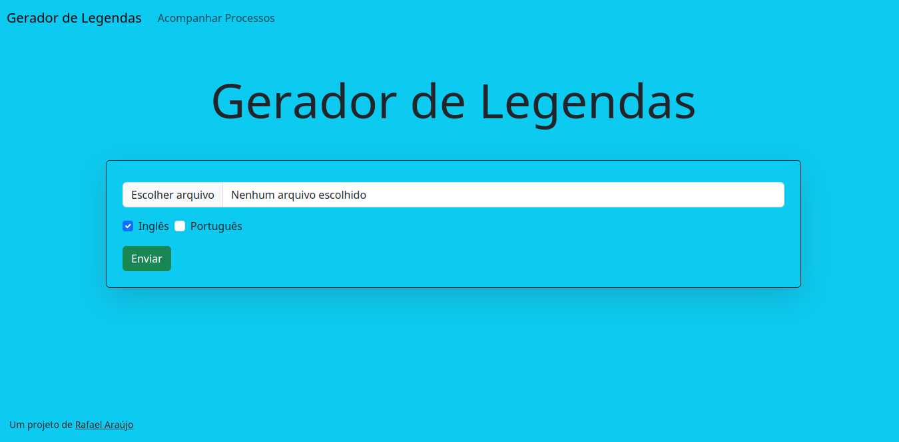

# Gerador de Legendas
## Plataforma para geração de arquivos .srt 
### Como utilizar
- Utilize o docker-compose para rodar uma versão de desenvolvimento do sistema localmente no seu computador
- Você precisará de credenciais para utilizar o Firebase Storage. Essas credenciais deverão estar nas pastas `server/` e `client/` sob o nome `firebase-key.json`. Mais informações na [documentação oficial](https://cloud.google.com/docs?hl=pt-br).
- A página poderá ser acessada em `localhost:5000`
```
docker-compose build
docker-compose up
```
> Espere até que todos os containers estejam devidamente inicializados para utilizar o sistema
---
 

# Como funciona
### Tecnologias Utilizadas
- [Python](https://www.python.org/)
- [Flask](https://flask.palletsprojects.com/en/2.2.x/)
- [Redis](https://redis.io/)
- [Rabbitmq](https://www.rabbitmq.com/)
- [Firebase Storage](https://firebase.google.com/docs/storage)
- [Docker](https://www.docker.com/)
- [Docker-Compose](https://docs.docker.com/compose/)

### Passo-a-Passo: Geração de Lengendas
1. Extração do áudio
2. Detecção de silêncios
3. Fragmentação do áudio de acordo com os tempos das falas
4. Transcrição e tradução individual de cada fala
5. Formatação do arquivo final
